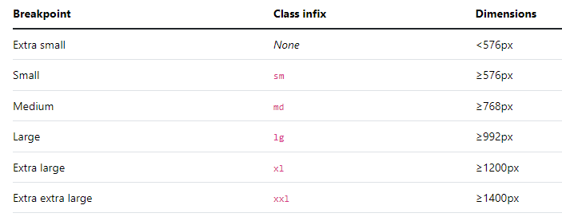
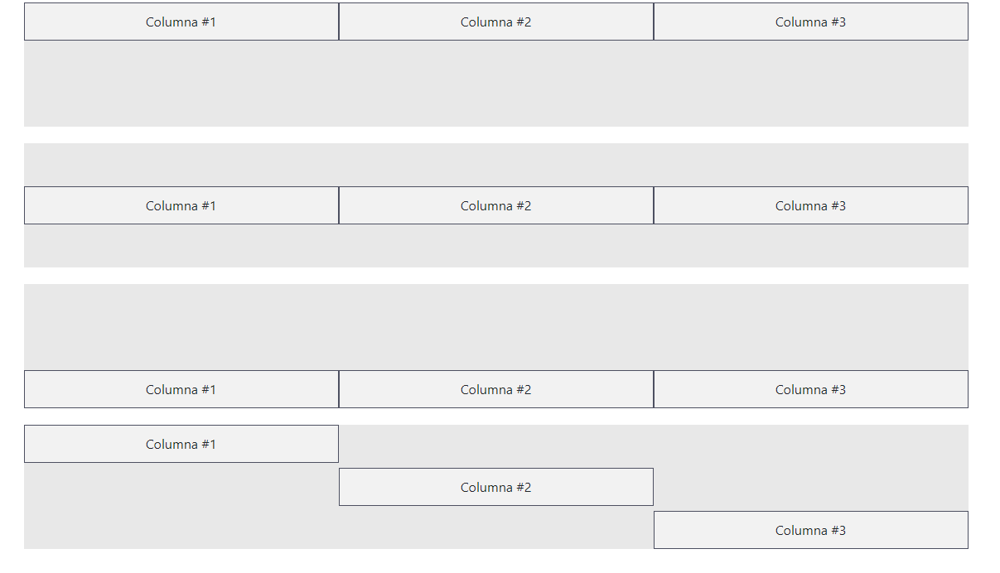
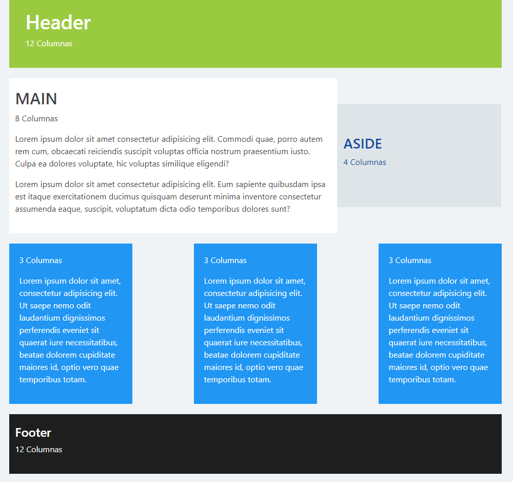

# SECCION 2: GRID DE BOOTSTRAP

# 6. Que es la grid de Bootstrap

# 7. Creando nuestra primera pagina utilizando la grid



```html
<!DOCTYPE html>
<html lang="en">

<head>
    <meta charset="UTF-8">
    <meta http-equiv="X-UA-Compatible" content="IE=edge">
    <meta name="viewport" content="width=device-width, initial-scale=1.0">
    <title>Grid</title>
    <link rel="stylesheet" href="../css/bootstrap.min.css">
    <style>
        .row > div {
            background: #f2f2f2;
            margin: 10px 0;
            padding: 40px;
        }
    </style>
</head>

<body>
    <div class="container">
        <div class="row">
            <div class="col col-lg-6">
                <h1>Hola Mundo</h1>
                <p>Lorem ipsum dolor sit amet consectetur, adipisicing elit. Ut quaerat dolores quibusdam aliquid fuga, alias ab voluptas quos ipsa, incidunt soluta ratione optio omnis explicabo aliquam maiores laudantium quis impedit.</p>
                <button class="btn btn-primary">Ver mas</button>
            </div>
            <div class="col col-lg-6">
                <h1>Hola Mundo</h1>
                <p>Lorem ipsum dolor sit amet consectetur, adipisicing elit. Ut quaerat dolores quibusdam aliquid fuga, alias ab voluptas quos ipsa, incidunt soluta ratione optio omnis explicabo aliquam maiores laudantium quis impedit.</p>
                <button class="btn btn-primary">Ver mas</button>
            </div>
            <div class="col-12">
                <h1>Hola Mundo</h1>
                <p>Lorem ipsum dolor sit amet consectetur, adipisicing elit. Ut quaerat dolores quibusdam aliquid fuga, alias ab voluptas quos ipsa, incidunt soluta ratione optio omnis explicabo aliquam maiores laudantium quis impedit.</p>
                <button class="btn btn-primary">Ver mas</button>
            </div>
        </div>

    </div>
    <script src="../js/bootstrap.bundle.min.js"></script>
</body>

</html>
```

# 8. Columnas automaticas

```html
<!DOCTYPE html>
<html lang="en">

<head>
    <meta charset="UTF-8">
    <meta http-equiv="X-UA-Compatible" content="IE=edge">
    <meta name="viewport" content="width=device-width, initial-scale=1.0">
    <title>Columnas Anidadas</title>
    <link rel="stylesheet" href="../css/bootstrap.min.css">
    <style>
        .container {
            margin-top: 20px;
        }
        .row {
            background: #e8e8e8;
        }
        .columna {
            background: #f2f2f2;
            text-align: center;
            border: 1px solid #8d8d8d;
        }
        .columna-interior {
            background: #e8e8e8;
            border: 1px solid #8d8d8d;
            padding: 10px;
        }
    </style>
</head>

<body>

    <div class="container">
        <div class="row">
            <div class="columna col-12 col-md-6">
                Columna #1
                <div class="row">
                    <div class="columna-interior col-12 col-md-6">Columna Interior #1</div>
                    <div class="columna-interior col-12 col-md-6">Columna Interior #2</div>
                </div>
            </div>
            <div class="columna col-12 col-md-6">
                Columna #2
                <div class="row">
                    <div class="columna-interior col-12 col-md-6">Columna Interior #1</div>
                    <div class="columna-interior col-12 col-md-6">Columna Interior #2</div>
                </div> 
            </div>
        </div>
    </div>


    <script src="../js/bootstrap.bundle.min.js"></script>
</body>

</html>
```

# 9. Row Columns

```html
<!DOCTYPE html>
<html lang="en">

<head>
    <meta charset="UTF-8">
    <meta http-equiv="X-UA-Compatible" content="IE=edge">
    <meta name="viewport" content="width=device-width, initial-scale=1.0">
    <title>Row Columns</title>
    <link rel="stylesheet" href="../css/bootstrap.min.css">
    <style>
        .row {
            background: #e8e8e8;
            margin-top: 20px;
        }
        .col {
            background: #f2f2f2;
            text-align: center;
            padding: 10px;
            border: 1px solid #4d5061;
        }
    </style>
</head>

<body>
    <div class="container">
        <div class="row row-cols-5">
            <div class="col">Columna #1</div>
            <div class="col">Columna #2</div>
            <div class="col">Columna #3</div>
            <div class="col">Columna #4</div>
            <div class="col">Columna #5</div>
            <div class="col">Columna #6</div>
        </div>
    </div>


    <script src="../js/bootstrap.bundle.min.js"></script>
</body>

</html>
```

# 10. Alineando columnas verticalmente

```html
<!DOCTYPE html>
<html lang="en">
<head>
    <meta charset="UTF-8">
    <meta http-equiv="X-UA-Compatible" content="IE=edge">
    <meta name="viewport" content="width=device-width, initial-scale=1.0">
    <title>Columnas Alineadas Verticalmente</title>
    <link rel="stylesheet" href="../css/bootstrap.min.css">
    <style>
        .row {
            background: #e8e8e8;
            margin-top: 20px;
            height: 150px;
        }
        .col {
            background: #f2f2f2;
            text-align: center;
            padding: 10px;
            border: 1px solid #4d5061;
        }
    </style>
</head>
<body>
    <div class="container">
        <div class="row align-items-start">
            <div class="col">Columna #1</div>
            <div class="col">Columna #2</div>
            <div class="col">Columna #3</div>             
        </div>
        <div class="row align-items-center">
            <div class="col">Columna #1</div>
            <div class="col">Columna #2</div>
            <div class="col">Columna #3</div>             
        </div>
        <div class="row align-items-end">
            <div class="col">Columna #1</div>
            <div class="col">Columna #2</div>
            <div class="col">Columna #3</div>             
        </div>
        <div class="row">
            <div class="col align-self-start">Columna #1</div>
            <div class="col align-self-center">Columna #2</div>
            <div class="col align-self-end">Columna #3</div>             
        </div>
    </div>

    <script src="../js/bootstrap.bundle.min.js"></script>
</body>
</html>
```



# 11. Alineando columnas horizontalmente

```html
<!DOCTYPE html>
<html lang="en">
<head>
    <meta charset="UTF-8">
    <meta http-equiv="X-UA-Compatible" content="IE=edge">
    <meta name="viewport" content="width=device-width, initial-scale=1.0">
    <title>Columnas Alineadas Horizontalmente</title>
    <link rel="stylesheet" href="../css/bootstrap.min.css">
    <style>
        .row {
            background: #e8e8e8;
            margin-top: 20px;
        }
        .columna {
            background: #f2f2f2;
            text-align: center;
            padding: 10px;
            border: 1px solid #4d5061;
        }
    </style>
</head>
<body>
    <div class="container">
        <div class="row justify-content-start">
            <div class="columna col-4">Columna 1</div>
            <div class="columna col-4">Columna 2</div>
        </div>
        <div class="row justify-content-center">
            <div class="columna col-4">Columna 1</div>
            <div class="columna col-4">Columna 2</div>
        </div>
        <div class="row justify-content-end">
            <div class="columna col-4">Columna 1</div>
            <div class="columna col-4">Columna 2</div>
        </div>
        <div class="row justify-content-around">
            <div class="columna col-4">Columna 1</div>
            <div class="columna col-4">Columna 2</div>
        </div>
        <div class="row justify-content-between">
            <div class="columna col-4">Columna 1</div>
            <div class="columna col-4">Columna 2</div>
        </div>
        <div class="row justify-content-evenly">
            <div class="columna col-4">Columna 1</div>
            <div class="columna col-4">Columna 2</div>
        </div>
    </div>

    <script src="../js/bootstrap.bundle.min.js"></script>
</body>
</html>
```

# 12. Espaciados entre columnas (Gutters)

En Bootstrap, los "gutters" se refieren al espacio (márgenes) entre las columnas dentro del sistema de rejilla (grid). Este espacio es importante para que los elementos dentro de las columnas no se vean amontonados, permitiendo que el diseño tenga una apariencia más limpia y organizada.

En Bootstrap 5, el tamaño de los gutters se mide en píxeles y se aplica a ambos lados de cada columna. El valor por defecto del gutter es 1.5rem (24px).
Puedes ajustar el tamaño del gutter usando clases de utilidad, como .g-0, .g-1, .g-2, hasta .g-5, donde 0 elimina el espacio y 5 lo maximiza.

Si deseas eliminar los gutters por completo, puedes usar la clase .g-0 en el contenedor de la fila (row). Esto elimina los márgenes entre las columnas, haciendo que se toquen entre sí.

```html
<!DOCTYPE html>
<html lang="en">

<head>
    <meta charset="UTF-8">
    <meta http-equiv="X-UA-Compatible" content="IE=edge">
    <meta name="viewport" content="width=device-width, initial-scale=1.0">
    <title>Gutters</title>
    <link rel="stylesheet" href="../css/bootstrap.min.css">
    <style>
        .row {
            background: #e8e8e8;
            margin-top: 20px;
        }
        .contenido {
            background: #f2f2f2;
            text-align: center;
            padding: 10px;
            border: 1px solid #4d5061;
        }
    </style>
</head>

<body>
    <div class="container">
        <div class="row gx-5 gy-5">
            <div class="col-6">
                <div class="contenido">Columna 1</div>
            </div>
            <div class="col-6">
                <div class="contenido">Columna 2</div>
            </div>
            <div class="col-6">
                <div class="contenido">Columna 3</div>
            </div>
            <div class="col-6">
                <div class="contenido">Columna 4</div>
            </div>
        </div>
    </div>


    <script src="../js/bootstrap.bundle.min.js"></script>

</body>

</html>
```

# 13. Utilidades de la grid de Bootstrap

- Offset: El offset se utiliza para crear espacio en blanco a la izquierda de una columna, desplazándola hacia la derecha. Esto es útil para centrar columnas o crear espacios entre columnas sin necesidad de agregar columnas vacías.

<!-- <div class="row">
  <div class="col-md-4 offset-md-4">
    Column centered with offset
  </div>
</div> -->

- col-auto: Es útil cuando tienes contenido que no necesita ocupar todo el espacio asignado por el grid y prefieres que la columna tenga el tamaño necesario para el contenido.

<!-- <div class="row">
  <div class="col-auto">
    Column with auto width
  </div>
  <div class="col">
    Column that takes the remaining space
  </div>
</div> -->

- me-auto y ms-auto: Las clases me-auto (margin-end auto) y ms-auto (margin-start auto) se utilizan para aplicar márgenes automáticos que ayudan a alinear elementos dentro de un contenedor o grid. me-auto: Aplica margen automático al final (end) de un elemento, empujándolo hacia la izquierda (en un entorno LTR, de izquierda a derecha). ms-auto: Aplica margen automático al inicio (start) de un elemento, empujándolo hacia la derecha 
 
```html
<!DOCTYPE html>
<html lang="en">

<head>
    <meta charset="UTF-8">
    <meta http-equiv="X-UA-Compatible" content="IE=edge">
    <meta name="viewport" content="width=device-width, initial-scale=1.0">
    <title>Utilidades Para Columnas</title>
    <link rel="stylesheet" href="../css/bootstrap.min.css">
    <style>
        .row {
            background: #e8e8e8;
            margin-top: 20px;
        }

        .columna {
            background: #f2f2f2;
            text-align: center;
            padding: 10px;
            border: 1px solid #4d5061;
        }
    </style>
</head>

<body>
    <div class="container">
        <div class="row">
            <div class="columna col order-4 order-md-1">Columna 1</div>
            <div class="columna col order-3 order-md-2">Columna 2</div>
            <div class="columna col order-2 order-md-3">Columna 3</div>
            <div class="columna col order-1 order-md-4">Columna 4</div>
        </div>

        <div class="row">
            <div class="columna col-3 offset-3">Columna</div>
        </div>
        <div class="row">
            <div class="columna col-3 offset-3">Columna 1</div>
            <div class="columna col-3">Columna 2</div>
        </div>
        <div class="row">
            <div class="columna col-auto me-auto">Columna 1</div>
            <div class="columna col-auto">Columna 2</div>
        </div>
    </div>

    <script src="../js/bootstrap.bundle.js"></script>
</body>

</html>
```

# 14. Practica: Creando un sitio responsive

**MI PROPUESTA**

```html
<!DOCTYPE html>
<html lang="en">

<head>
    <meta charset="UTF-8">
    <meta http-equiv="X-UA-Compatible" content="IE=edge">
    <meta name="viewport" content="width=device-width, initial-scale=1.0">
    <link rel="stylesheet" href="css/bootstrap.min.css">
    <link rel="stylesheet" href="css/estilos.css">
    <title>Grid de Bootstrap 5</title>
</head>

<body>
    <div class="container">
        <header class="row">
            <div class="col">
                <h1>Header</h1>
                <p>12 columnas</p>
            </div>
        </header>
        <section class="principal row align-items-center">
            <main class="col-8">
                <h2>MAIN</h2>
                <p>8 Columnas</p>
                <p>Lorem ipsum dolor sit amet consectetur adipisicing elit. Reiciendis, placeat quae? Nesciunt, laboriosam. Aspernatur dolore tempora debitis ut illo. Delectus sint fugit adipisci ipsum exercitationem tempora provident a, deleniti beatae!</p>
                <p>Lorem ipsum dolor sit amet consectetur adipisicing elit. Reiciendis, placeat quae? Nesciunt, laboriosam. Aspernatur dolore tempora debitis ut illo. Delectus sint fugit adipisci ipsum exercitationem tempora provident a, deleniti beatae!</p>
            </main>
            <aside class="col-4">
                <h2>ASIDE</h2>
                <p>4 Columnas</p>
            </aside>
        </section>
        <section class="row justify-content-between">
            <div class="columna col-3">
                <h3>3 columnas</h3>
                <p>Lorem ipsum dolor sit amet consectetur adipisicing elit. Pariatur rerum fugit error aspernatur accusamus itaque in accusantium odio ipsam, aut dicta omnis tempore necessitatibus asperiores impedit id ut. Culpa, blanditiis?</p>
            </div>
            <div class="columna col-3">
                <h3>3 columnas</h3>
                <p>Lorem ipsum dolor sit amet consectetur adipisicing elit. Pariatur rerum fugit error aspernatur accusamus itaque in accusantium odio ipsam, aut dicta omnis tempore necessitatibus asperiores impedit id ut. Culpa, blanditiis?</p>
            </div>
            <div class="columna col-3">
                <h3>3 columnas</h3>
                <p>Lorem ipsum dolor sit amet consectetur adipisicing elit. Pariatur rerum fugit error aspernatur accusamus itaque in accusantium odio ipsam, aut dicta omnis tempore necessitatibus asperiores impedit id ut. Culpa, blanditiis?</p>
            </div>
        </section>
        <footer class="row">
            <h3>Footer</h3>
            <p>12 columnas</p>
        </footer>
    </div>

    <script src="js/bootstrap.bundle.min.js"></script>
</body>

</html>
```

```css
body {
    background: #f0f3f5;
    color: #fff;
}

header {
    background: #9aca40;
    padding: 20px;
    margin-bottom: 20px;
}

.principal {
    margin-bottom: 20px;
}

main {
    background-color: #fff;
    color: #424242;
    padding: 20px;
}

aside {
    background: #dee5e8;
    color: #0d47a1;
    padding: 50px;
}

.columna {
    background: #6498e7;
    padding: 20px;
    margin-bottom: 20px;
}

.columna h3 {
    font-size: 18px;
    font-weight: normal;
}

footer {
    background: #000;
    padding: 10px;
}
```

**DESARROLLO DEL DOCENTE**

```html
<!DOCTYPE html>
<html lang="en">

<head>
    <meta charset="UTF-8">
    <meta http-equiv="X-UA-Compatible" content="IE=edge">
    <meta name="viewport" content="width=device-width, initial-scale=1.0">
    <link rel="stylesheet" href="css/bootstrap.min.css">
    <link rel="stylesheet" href="css/estilos.css">
    <title>Grid de Bootstrap 5</title>
</head>

<body>
    <div class="container">
        <header class="row">
            <div class="col">
                <h1>Header</h1>
                <p>12 Columnas</p>
            </div>
        </header>
        <section class="contenedor-main row align-items-center">
            <main class="col-md-8">
                <h2>MAIN</h2>
                <p class="d-none d-md-block">8 Columnas</p>
                <p class="d-block d-md-none">12 Columnas</p>
                <p>Lorem ipsum dolor sit amet consectetur adipisicing elit. Commodi quae, porro autem rem cum, obcaecati reiciendis suscipit voluptas officia nostrum praesentium iusto. Culpa ea dolores voluptate, hic voluptas similique eligendi?</p>
                <p>Lorem ipsum dolor sit amet consectetur adipisicing elit. Eum sapiente quibusdam ipsa est itaque exercitationem ducimus quisquam deserunt minima inventore consectetur assumenda eaque, suscipit, voluptatum dicta odio temporibus dolores sunt?</p>
            </main>
            <aside class="col-md-4">
                <h3>ASIDE</h3>
                <p class="d-none d-md-block">4 Columnas</p>
                <p class="d-block d-md-none">12 Columnas</p>
            </aside>
        </section>
        <section class="row widgets justify-content-between">
            <div class="col-12 col-md-4 col-lg-3">
                <p class="d-none d-lg-block">3 Columnas</p>
                <p class="d-none d-md-block d-lg-none">4 Columnas</p>
                <p class="d-block d-md-none">12 Columnas</p>
                <p>Lorem ipsum dolor sit amet, consectetur adipisicing elit. Ut saepe nemo odit laudantium dignissimos perferendis eveniet sit quaerat iure necessitatibus, beatae dolorem cupiditate maiores id, optio vero quae temporibus totam.</p>
            </div>
            <div class="col-12 col-md-4 col-lg-3">
                <p class="d-none d-lg-block">3 Columnas</p>
                <p class="d-none d-md-block d-lg-none">4 Columnas</p>
                <p class="d-block d-md-none">12 Columnas</p>
                <p>Lorem ipsum dolor sit amet, consectetur adipisicing elit. Ut saepe nemo odit laudantium dignissimos perferendis eveniet sit quaerat iure necessitatibus, beatae dolorem cupiditate maiores id, optio vero quae temporibus totam.</p>
            </div>
            <div class="col-12 col-md-4 col-lg-3">
                <p class="d-none d-lg-block">3 Columnas</p>
                <p class="d-none d-md-block d-lg-none">4 Columnas</p>
                <p class="d-block d-md-none">12 Columnas</p>
                <p>Lorem ipsum dolor sit amet, consectetur adipisicing elit. Ut saepe nemo odit laudantium dignissimos perferendis eveniet sit quaerat iure necessitatibus, beatae dolorem cupiditate maiores id, optio vero quae temporibus totam.</p>
            </div>
        </section>
        <footer class="row">
            <div class="col">
                <h4>Footer</h4>
                <p>12 Columnas</p>
            </div>
        </footer>
    </div>

    <script src="js/bootstrap.bundle.min.js"></script>
</body>

</html>
```

```css
body {
    background: #f0f3f5;
    color: #fff;
}

header {
    background: #9aca40;
    padding: 20px;
    margin-bottom: 20px;
}

.contenedor-main {
    margin-bottom: 20px;
} 

main {
    background-color: #fff;
    color: #424242;
    padding: 20px 0;
}

aside {
    background-color: #dee5e8;
    padding: 60px 0;
    color: #0d47a1;
}

.widgets {
    margin-bottom: 20px;
}

.widgets > div {
    background-color: #2196f3;
    color: #fff;
    padding: 20px;
}

footer {
    padding: 20px 0;
    background-color: #1e1e1e;
}
```

